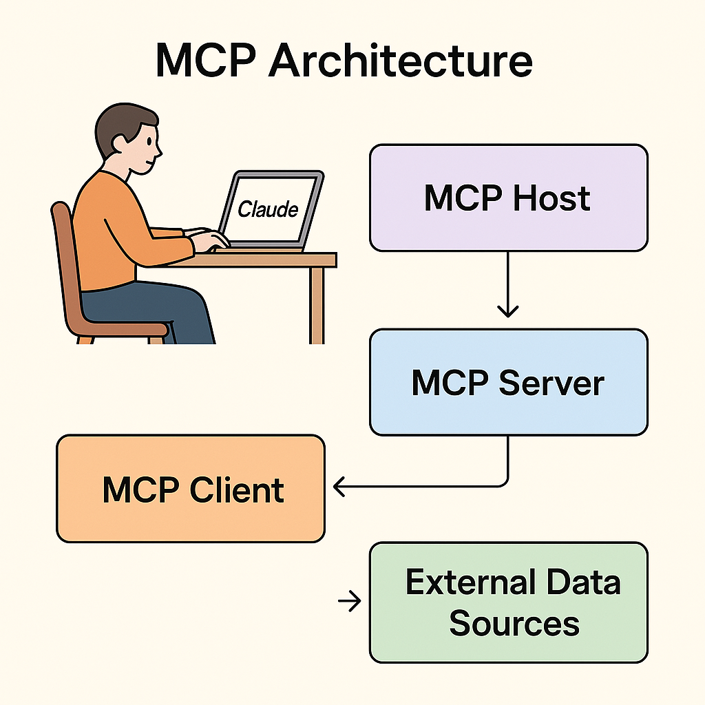

# Documentation MCP Server 📚🔍

A Model Context Protocol (MCP) server that enables Claude to search and access documentation from popular libraries like LangChain, LlamaIndex, and OpenAI directly within conversations.

## What is MCP? 🤔

MCP (Model Context Protocol) is an open protocol that standardizes how applications provide context to Large Language Models. Think of it as a universal connector that lets AI assistants like Claude access external data sources and tools.




## Features ✨

- **Documentation Search Tool**: Search through documentation of popular AI libraries
- **Supported Libraries**:
  - [LangChain](https://python.langchain.com/docs) 🔗
  - [LlamaIndex](https://docs.llamaindex.ai/en/stable) 🦙
  - [OpenAI](https://platform.openai.com/docs) 🤖
- **Smart Extraction**: Intelligently parses HTML content to extract the most relevant information
- **Configurable Results**: Limit the amount of text returned based on your needs

## How It Works 🛠️

1. The server uses the Serper API to perform Google searches with site-specific queries
2. It fetches the content from the search results
3. BeautifulSoup extracts the most relevant text from main content areas
4. Claude can access this information through the `get_docs` tool

## System Requirements 🖥️

- Python 3.11 or higher
- `uv` package manager
- A Serper API key

## Setup Instructions 🚀

### 1. Install uv Package Manager

```bash
curl -LsSf https://astral.sh/uv/install.sh | sh
```

### 2. Clone and Set Up the Project

```bash
# Clone or download the project
cd documentation

# Create and activate virtual environment
uv venv
# On Windows:
.venv\Scripts\activate
# On macOS/Linux:
source .venv/bin/activate

# Install dependencies
uv pip install -e .
```

### 3. Configure the Serper API Key

Create a `.env` file in the project directory with your Serper API key:

```
SERPER_API_KEY=your_serper_api_key_here
```

You can get a Serper API key by signing up at [serper.dev](https://serper.dev).

### 4. Configure Claude Desktop

Edit your Claude Desktop configuration file at:
- Windows: `/C:/Users/[Your Username]/AppData/Roaming/Claude/claude_desktop_config.json`

- macOS: `~/Library/Application Support/Claude/claude_desktop_config.json`

Add the following to the `mcpServers` section:

```json
"documentation": {
  "command": "uv",
  "args": [
    "--directory",
    "/ABSOLUTE/PATH/TO/YOUR/documentation",
    "run",
    "main.py"
  ]
}
```

Replace `/ABSOLUTE/PATH/TO/YOUR/documentation` with the absolute path to your project directory.

### 5. Restart Claude Desktop

Close and reopen Claude Desktop to apply the new configuration.

## Using the Documentation Tool 🧩

Once connected, you can ask Claude to use the documentation tool:

> "Can you look up information about vector stores in LangChain documentation?"

Claude will use the `get_docs` tool to search for relevant information and provide you with documentation excerpts.

## Tool Parameters 📋

The `get_docs` tool accepts the following parameters:

- `query`: The search term (e.g., "vector stores", "embedding models")
- `library`: Which library to search (langchain, llama-index, or openai)
- `max_chars`: Maximum characters to return (default: 1000)

## Troubleshooting 🛠️

- **Claude can't find the server**: Verify the path in `/C:/Users/fcbsa/AppData/Roaming/Claude/claude_desktop_config.json` is correct
- **Search returns no results**: Check your Serper API key and internet connection
- **Timeout errors**: The server might be experiencing connectivity issues or rate limits

## License 📜

This project is provided as an educational example of MCP server implementation.

## Acknowledgements 🙏

- Built using the [MCP SDK](https://github.com/modelcontextprotocol)
- Powered by [Serper API](https://serper.dev) for Google search integration
- Uses [BeautifulSoup4](https://www.crummy.com/software/BeautifulSoup/) for HTML parsing
- Inspired by the growing MCP community

---

*This MCP server enhances Claude's capabilities by providing direct access to documentation resources. Explore, learn, and build better AI applications with contextual knowledge from the docs!*